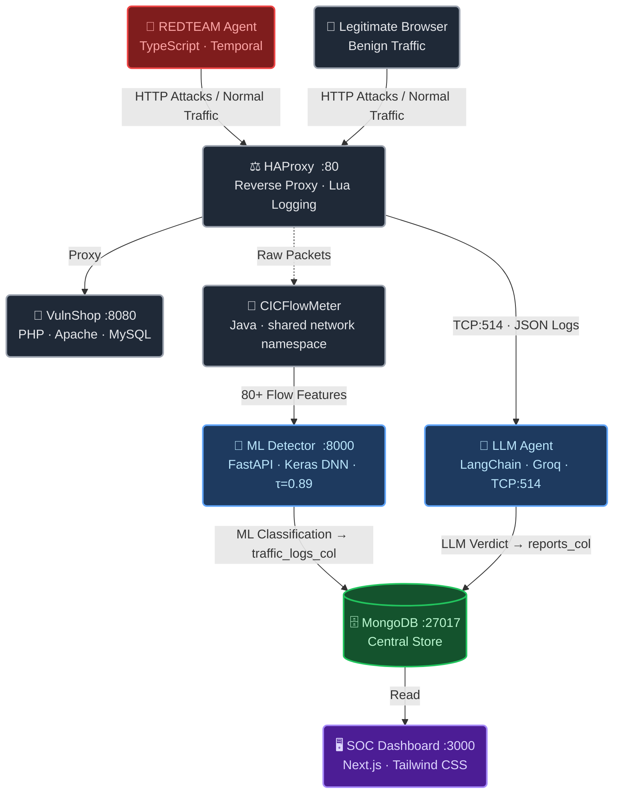
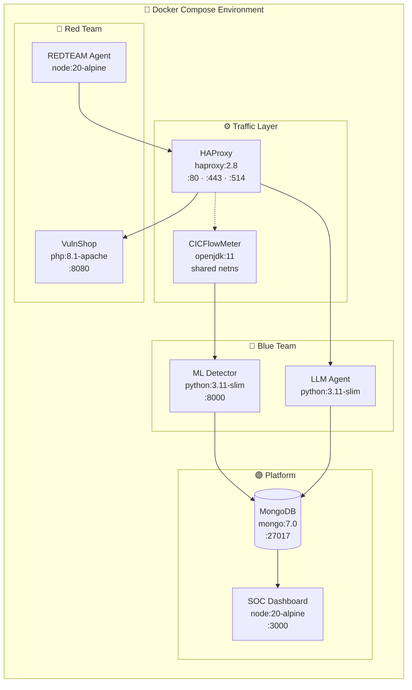
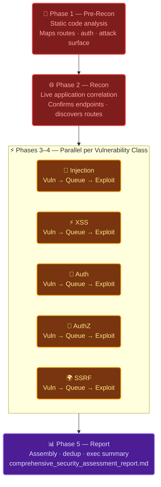
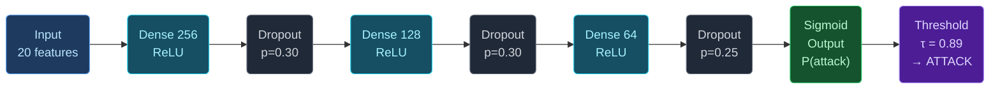
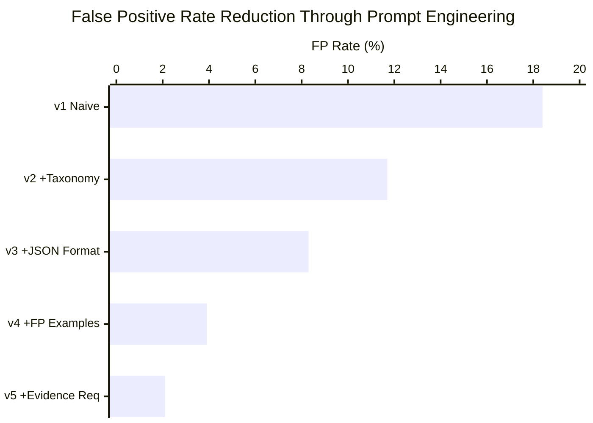
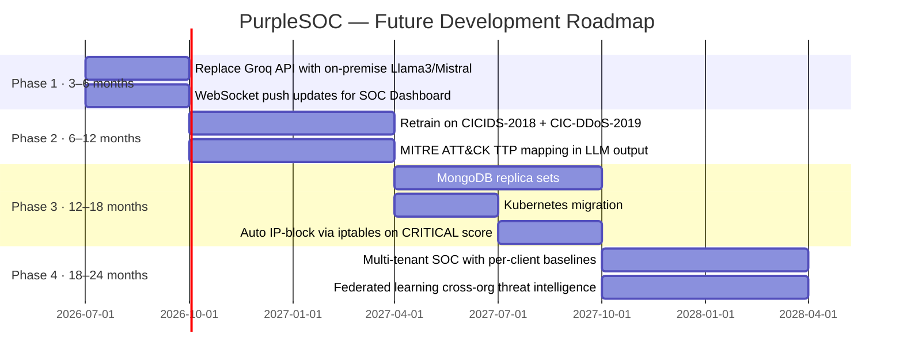

<div align="center">


<br/>

[](https://git.io/typing-svg)

<br/>

<!-- Tech Badges -->


<br/>


<br/><br/>

<!-- Metric Badges -->


<br/><br/>

</div>

---

## 📋 Table of Contents

- [Abstract](#-abstract)
- [System Architecture](#-system-architecture)
- [Tech Stack](#-tech-stack)
- [Docker Containers](#-docker-containers)
- [🔴 Red Team — REDTEAM Agent](#-red-team--redteam-agent)
- [🔵 Blue Team — Dual Detection Engines](#-blue-team--dual-detection-engines)
- [📊 Performance Results](#-performance-results)
- [🎯 Dual-Engine Detection Coverage](#-dual-engine-detection-coverage)
- [🚀 Getting Started](#-getting-started)
- [🗺️ Roadmap](#-roadmap)
- [👥 Team](#-team)
- [📚 References](#-references)

---

## 📖 Abstract

**PurpleSOC** is a complete, production-grade cybersecurity research platform that unifies offensive simulation *(Red Team)* and defensive monitoring *(Blue Team)* within a single, fully containerised Docker Compose environment.

The system is designed around three core insights:

> 🔍 **Detection accuracy** requires two complementary intelligence modalities operating in parallel  
> 🏠 **Data sovereignty** mandates full on-premise operation with zero third-party traffic routing  
> 🖥️ **Analyst productivity** requires a single unified dashboard rather than fragmented tools

A Keras deep neural network trained on **CICIDS-2017** (565,576 held-out flows) and a prompt-engineered **LLM semantic analysis layer** operate in parallel — an attacker must simultaneously fool two fundamentally different detection mechanisms to evade detection.

---

## 🏗️ System Architecture



---

## 🛠️ Tech Stack

<div align="center">

[](https://skillicons.dev)

[](https://skillicons.dev)

</div>

<br/>

<div align="center">

| Layer | Technology | Role |
|---|---|---|
| 🔴 **Red Team Orchestration** | TypeScript · Node.js · Temporal | Durable 5-phase pentest pipeline |
| 🔴 **Red Team LLM Engine** | OpenAI-compat SDK · Ollama · OpenRouter | Provider-agnostic agent loop |
| 🔴 **Vulnerable Target** | PHP 8.1 · Apache · MySQL | Full OWASP Top 10 attack surface |
| ⚖️ **Reverse Proxy** | HAProxy 2.8 · Lua | Zero-latency JSON payload mirroring |
| 📡 **Flow Analysis** | CICFlowMeter · Java · OpenJDK 11 | 80+ bidirectional flow features |
| 🤖 **ML Detection** | Keras · TensorFlow · FastAPI · scikit-learn | DNN binary classifier, <8ms inference |
| 🧠 **LLM Detection** | LangChain · Groq · Pydantic · PyMongo | Semantic payload analysis |
| 🗄️ **Storage** | MongoDB 7.0 | Central document store |
| 🖥️ **Dashboard** | Next.js 14 · TypeScript · Tailwind CSS | Real-time SOC analyst interface |
| 🐳 **Orchestration** | Docker Compose | 7-container isolated environment |

</div>

---

## 🐳 Docker Containers



| Container | Base Image | Port(s) | Responsibility |
|---|---|---|---|
| **VulnShop** | `php:8.1-apache` | `8080` | Deliberately vulnerable PHP e-commerce app (OWASP Top 10) |
| **HAProxy** | `haproxy:2.8` | `80, 443, 514` | Reverse proxy + embedded Lua script for zero-latency JSON logging |
| **CICFlowMeter** | `openjdk:11` | — | Shares HAProxy's network namespace; captures raw packets → 80+ flow features |
| **ML Detector** | `python:3.11-slim` | `8000` | FastAPI + Keras DNN; receives feature vectors, returns Attack/Benign |
| **LLM Agent** | `python:3.11-slim` | — | TCP:514 socket server → LangChain/Groq → structured threat verdict → MongoDB |
| **MongoDB** | `mongo:7.0` | `27017` | Central document store for both detection engines |
| **SOC Dashboard** | `node:20-alpine` | `3000` | Next.js frontend; real-time threat feed, maps, charts |

---

## 🔴 Red Team — REDTEAM Agent

REDTEAM is a TypeScript/Node.js autonomous penetration testing framework. It combines static code analysis with live application probing through a **five-phase, Temporal-orchestrated, LLM-driven pipeline**.

### Five-Phase Pipeline



### Agent Model Tier Assignments

| Agent | Tier | Model | Rationale |
|---|---|---|---|
| Pre-Recon | **Large** | `qwen3:32b` | Deep static analysis, max context window |
| Recon | **Medium** | `qwen3:8b` | Live correlation needs reliable tool calling |
| Vulnerability agents (×5) | **Medium** | `qwen3:8b` | Tool-use heavy; balance speed + reasoning |
| Exploit agents (×5) | **Medium** | `qwen3:8b` | Evidence-first, conditional execution |
| Report / Summarisation | **Small** | `llama3.2:3b` | Extraction only; no complex reasoning |

### Supported LLM Providers

| Provider | API Key | Best For |
|---|---|---|
| `ollama` | No | Local / offline / development |
| `openrouter` | Yes | Cloud production scans |
| `agent_router` | Optional | Custom routing infrastructure |
| `openai_compat` | Optional | Any OpenAI-compatible endpoint |

<details>
<summary><b>🔌 Provider Pool — Resilience Against Rate Limits</b></summary>

<br/>

Configure multiple providers with `REDTEAM_PROVIDER_1_*`, `REDTEAM_PROVIDER_2_*`, etc.

The pool implements automatic failover with **two-tier cooldowns**:

| Error Type | Base Cooldown | Max Cooldown |
|---|---|---|
| `rate_limit` (HTTP 429) | 60s | 5 minutes |
| `transient` (timeout / network / server) | 10s | 60 seconds |

- On any `error.retryable === true` → rotate to next provider
- `maxAttempts = providers.length × 3`
- All providers use a `300s` timeout to handle large tool-call context

</details>

---

## 🔵 Blue Team — Dual Detection Engines

### Engine 1 — Deep Learning IDS (`ml_detector/detector.py`)

A fully-connected neural network trained on **CICIDS-2017** classifying network flows as Attack or Benign using 20 discriminative CICFlowMeter features selected by Pearson correlation analysis.

#### Network Architecture



#### Training Configuration

| Parameter | Value |
|---|---|
| Optimiser | Adam (lr=1e-3, β₁=0.9, β₂=0.999) |
| Loss | Binary cross-entropy |
| Batch size | 512 |
| Max epochs | 100 (early stopping, patience=10) |
| Dataset split | 70% train / 15% val / 15% test (stratified) |
| Preprocessing | StandardScaler fitted on training set only |
| Threshold τ | 0.89 (F1-maximised sweep over 0.50→0.99) |
| Inference latency | ~8ms · ~120 req/s |

#### Training Results

<div align="center">

|  |
|---|
| *Fig 4.1 — Loss curves, accuracy and AUC-ROC converging over training epochs* |

|  |
|---|
| *Fig 4.3 — Confusion matrix (left) and ROC curve AUC=0.9994 (right) on held-out test set of 565,576 flows* |

</div>

---

### Engine 2 — LLM Semantic Agent (`agent/agent.py`)

A Python service that reads raw HTTP payloads from HAProxy (TCP:514) and performs semantic security analysis using a prompt-engineered LLM. This layer detects **application-layer attacks that flow statistics alone cannot see**.

#### Threat Score Formula

```
S = w_type × w_confidence × 10.0
```

| Attack Type | Weight | Rationale |
|---|---|---|
| `SQLi` | **1.00** | Full database compromise potential |
| `CMD_INJECTION` | **1.00** | Remote code execution potential |
| `PATH_TRAVERSAL` | **0.90** | Filesystem access; credential exposure |
| `SSRF` | **0.85** | Internal network pivoting |
| `XSS` | **0.75** | Client-side execution; session theft |
| `Benign` | **0.00** | No threat |

#### Prompt Engineering — v1 → v5 Iteration



| Version | FP Rate | FN Rate | Key Change |
|---|---|---|---|
| v1 (naive) | 18.4% | 4.2% | Free-form output, no examples |
| v2 | 11.7% | 4.8% | + Formal attack type taxonomy |
| v3 | 8.3% | 4.5% | + Mandatory structured JSON output |
| v4 | 3.9% | 4.1% | + Curated benign-traffic examples (FP guidance) |
| **v5** | **2.1%** | **3.8%** | **+ Evidence citation requirement** |

> **88.6% reduction in false positives** from v1 → v5, with simultaneous improvement in false negative rate.

<details>
<summary><b>📋 Production System Prompt Structure (v5)</b></summary>

<br/>

```
ATTACK TAXONOMY: SQLi | XSS | PATH_TRAVERSAL | CMD_INJECTION | SSRF | Benign

FALSE POSITIVE GUIDANCE:
  - "select" in a product search is NOT SQLi
  - HTML angle brackets in blog content are NOT XSS
  - ".." as part of a legitimate URL slug is NOT path traversal

REQUIRED JSON OUTPUT (no preamble, no markdown fences):
{
  "attack_type": "<SQLi|XSS|PATH_TRAVERSAL|CMD_INJECTION|SSRF|Benign>",
  "confidence": <float 0.0–1.0>,
  "severity": "<CRITICAL|HIGH|MEDIUM|LOW|NONE>",
  "evidence": "<exact string from payload>",
  "reasoning": "<1–2 sentence plain-English explanation>",
  "recommended_action": "<block|alert|monitor|allow>"
}
```

</details>

---

## 📊 Performance Results

<div align="center">

### ML Detector — Held-Out Test Set (N = 565,576 flows)

| Metric | Value | Visual |
|---|---|---|
| Overall Accuracy | **99.25%** | `████████████████████` 99.25% |
| AUC-ROC | **0.9994** | `████████████████████` 99.94% |
| F1-Score (Attack) | **0.9810** | `███████████████████░` 98.10% |
| Precision (Attack) | **97.80%** | `███████████████████░` 97.80% |
| Recall (Attack) | **98.39%** | `███████████████████░` 98.39% |

| Category | Count |
|---|---|
| ✅ True Positives | 109,524 |
| ✅ True Negatives | 451,801 |
| ❌ False Positives | 2,464 |
| ❌ False Negatives | 1,787 |
| 🎯 Decision Threshold | τ = 0.89 |

### System Latency & Throughput

| Component | Avg Latency | Throughput | Notes |
|---|---|---|---|
| HAProxy Lua logging | **< 1 ms** | > 10,000 req/s | In-RAM, no disk I/O |
| CICFlowMeter | ~50 ms/flow | ~2,000 flows/s | Post-flow computation |
| ML Detector | **~8 ms** | ~120 req/s | Single Keras forward pass |
| LLM Agent | 1.2–3.5 s | ~20 req/s | Primary bottleneck (API call) |
| MongoDB write | ~5 ms | ~3,000 writes/s | Single-node |
| Dashboard poll cycle | 5 s interval | — | Configurable |

</div>

---

## 🎯 Dual-Engine Detection Coverage

The core empirical claim: **an attacker must simultaneously fool two fundamentally different detection mechanisms**. Evading the ML engine requires statistically-normal traffic; evading the LLM engine requires a clean payload — the two requirements are contradictory for most attack classes.

```mermaid
vennDiagram
```

| Attack Scenario | 🤖 ML Engine | 🧠 LLM Engine | Why |
|---|---|---|---|
| Standard SQL injection | ✅ | ✅ | Both detect via complementary modalities |
| URL-encoded SQLi | ✅ | ✅ | LLM decodes encoding before analysis |
| **Slow SQLi (1 req / 5 min)** | ❌ | ✅ | Flow stats appear normal; LLM reads payload |
| Rapid automated scanning (500/min) | ✅ | ✅ | Both detect; ML via rate anomaly |
| **XSS in benign-looking flow** | ❌ | ✅ | Short GET looks statistically normal; LLM catches `<script>` |
| **DoS / SYN Flood** | ✅ | ❌ | Anomalous TCP flags; no HTTP payload to read |
| **CMD injection in JSON body** | ❌ | ✅ | JSON POST stats appear normal; LLM reads body |
| **Path traversal in GET param** | ❌ | ✅ | Single GET is statistically short/normal; LLM detects `../` |
| **DDoS Slowloris** | ✅ | ❌ | Long duration + low packet rate anomaly |
| Brute-force login (100/min) | ✅ | ✅ | ML via rate anomaly; LLM via repeated credential patterns |

> **Legend**: ✅ Detected · ❌ Evades (but the other engine catches it)

---

## 🚀 Getting Started

### Prerequisites

- Docker & Docker Compose
- Node.js ≥ 18 (for REDTEAM CLI)
- A Groq API key (for the LLM Blue Team Agent)
- An LLM provider for REDTEAM (Ollama recommended for dev)

### 1 — Clone & Configure

```bash
git clone https://github.com/<your-org>/purplesoc.git
cd purplesoc

cp .env.example .env
# Edit .env — add your GROQ_API_KEY and MONGO_URI
```

### 2 — Launch the Blue Team Stack

```bash
docker compose up -d
```

| Service | URL |
|---|---|
| 🛒 VulnShop | http://localhost:80 |
| 🖥️ SOC Dashboard | http://localhost:3000 |
| 🤖 ML Detector API | http://localhost:8000 |
| 🗄️ MongoDB | localhost:27017 |

### 3 — Run the Red Team Agent

```bash
cd shannon/redteam

# Install dependencies
pnpm install

# Configure your LLM provider
cp .env.example .env
# Set REDTEAM_PROVIDER=ollama (or openrouter / openai_compat)
# Set REDTEAM_BASE_URL, REDTEAM_API_KEY as needed

# Build and launch
./redteam build
./redteam start -t http://localhost:80 -r /path/to/vulnshop/source
```

<details>
<summary><b>⚙️ Environment Variables Reference</b></summary>

<br/>

```env
# Blue Team
GROQ_API_KEY=your_groq_api_key
MONGO_URI=mongodb://mongodb:27017/purplesoc

# REDTEAM — Single Provider
REDTEAM_PROVIDER=ollama
REDTEAM_BASE_URL=http://localhost:11434/v1
REDTEAM_API_KEY=                      # optional for Ollama
REDTEAM_SMALL_MODEL=llama3.2:3b
REDTEAM_MEDIUM_MODEL=qwen3:8b
REDTEAM_LARGE_MODEL=qwen3:32b

# REDTEAM — Provider Pool (multi-provider failover)
REDTEAM_PROVIDER_1_TYPE=ollama
REDTEAM_PROVIDER_1_BASE_URL=http://localhost:11434/v1

REDTEAM_PROVIDER_2_TYPE=openrouter
REDTEAM_PROVIDER_2_API_KEY=your_openrouter_key
```

</details>

<details>
<summary><b>📁 Repository Structure</b></summary>

<br/>

```
purplesoc/
├── agent/                   # 🧠 LLM Blue Team Agent (Python)
│   ├── agent.py             #    LangChain + Groq + socket server
│   └── Dockerfile
├── ml_detector/             # 🤖 ML Detector (FastAPI + Keras)
│   ├── detector.py          #    /predict endpoint + inference pipeline
│   └── Dockerfile
├── models/                  # 📦 Trained model artifacts
│   ├── ids_ann_model.h5     #    Keras DNN weights
│   ├── ids_scaler_top25.pkl #    Fitted StandardScaler
│   ├── top_25_features.pkl  #    Selected feature list
│   ├── optimal_threshold.pkl#    τ = 0.89
│   └── __notebook_source__.ipynb  # Training notebook
├── haproxy/                 # ⚖️ HAProxy + Lua logging
│   ├── haproxy.cfg
│   └── log_json.lua
├── sniffer/                 # 📡 CICFlowMeter container
├── soc-dashboard/           # 🖥️ Next.js SOC Dashboard
│   ├── app/                 #    Pages + API routes
│   └── components/          #    ~25 UI components
├── web/                     # 🛒 VulnShop PHP app
│   └── [35 PHP/CSS/JS files]
├── shannon/redteam/         # 🔴 REDTEAM pentest agent (TypeScript)
│   ├── apps/cli/            #    CLI entrypoint
│   └── apps/worker/         #    Temporal workflow + agent loop
├── docs/
│   ├── project-overview.md
│   └── explanations.md
└── docker-compose.yml       # 🐳 Full 7-container stack
```

</details>

---

## 🗺️ Roadmap



---

## 👥 Team

<div align="center">

| Member | Role | Domain |
|---|---|---|
| **Mahmoud** | AI Agents · LLM Pipelines · Prompt Engineering | `apps/worker/src/ai/` — provider layer, agent loop, pool |
| **Nabeel** | Attack Plan · Tool Calling · Temporal Workflows | `apps/worker/src/temporal/` · prompts · tool registry |
| **Ameera** | Blue Team ML · IDS Detector | `ml_detector/detector.py` · `models/` |
| **Dalia** | Blue Team ML · LLM Agent | `agent/agent.py` · prompt engineering |
| **Ahmed** | SOC Dashboard Frontend | `soc-dashboard/` — all Next.js components |
| **Zeyad** | Backend · VulnShop · Dashboard API | `web/` · `soc-dashboard/app/api/` |
| **Mohamed** | Architecture · Integration · Docker | `docker-compose.yml` · HAProxy · CICFlowMeter |
| **Ali** | Documentation · Testing · Validation | `docs/` · validation scripts · reproducibility |

<br/>

*Supervised by **Dr. Ali Elsherbeni Ahmed Takieldeen** · Delta University · SEC415 · 2025/2026*

</div>

---

## 📚 Key References

| # | Citation |
|---|---|
| [1] | OWASP Foundation (2021). *OWASP Top Ten 2021*. https://owasp.org/Top10/ |
| [2] | Sharafaldin et al. (2018). *Toward generating a new intrusion detection dataset.* ICISSP. |
| [3] | Ferrag et al. (2023). *From ChatGPT to ThreatGPT.* IEEE Access 11, 80218–80245. |
| [4] | Happe & Cito (2023). *Getting pwn'd by AI: Penetration testing with LLMs.* ESEC/FSE. |
| [5] | Abdulhammed et al. (2019). *Efficient network IDS based on deep learning.* Future Internet. |
| [6] | IBM Security (2023). *Cost of a Data Breach Report 2023.* |
| [7] | MITRE Corp. (2023). *MITRE ATT&CK Enterprise Matrix v14.* https://attack.mitre.org/ |

---

<div align="center">


<br/>

*"Real cybersecurity does not come from a monthly subscription to a third party who has never studied your specific application.*
*It comes from a system that learns what normal looks like in your specific context."*
*— PurpleSOC Team, 2026*

</div>


